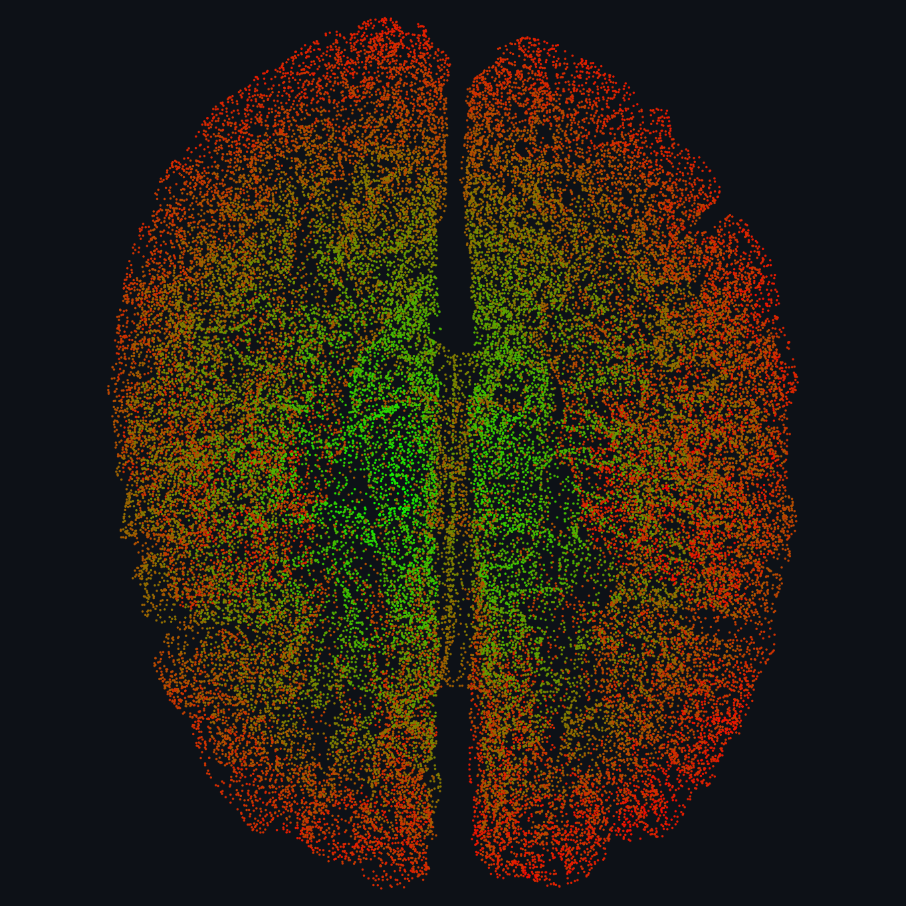

# Mesh → Dual Graph Transformation

Converts a 3D triangular mesh (`.obj`) into its dual graph in C and colors each face by Dijkstra hop-distance from a source face. Four edge-sorting strategies — selection sort, heap sort, AVL tree, hash table — benchmarked across meshes up to a 631k-face FreeSurfer DKT brain cortical surface; hash table is fastest at O(n) average.

Report: [`docs/report.pdf`](docs/report.pdf) · Hashmap (vendored): [tidwall/hashmap.c](https://github.com/tidwall/hashmap.c)

 

## Run

The binary reads one space-separated line from stdin: `<input.obj> <output.obj> <selectionsort|heapsort|avltree|hashtable> <y|n>`.

```bash
make build
echo "assets/meshes/brain.obj out_brain.obj hashtable y" | ./exefile
echo "assets/meshes/bunny10k.obj out_bunny.obj hashtable y" | ./exefile
```
