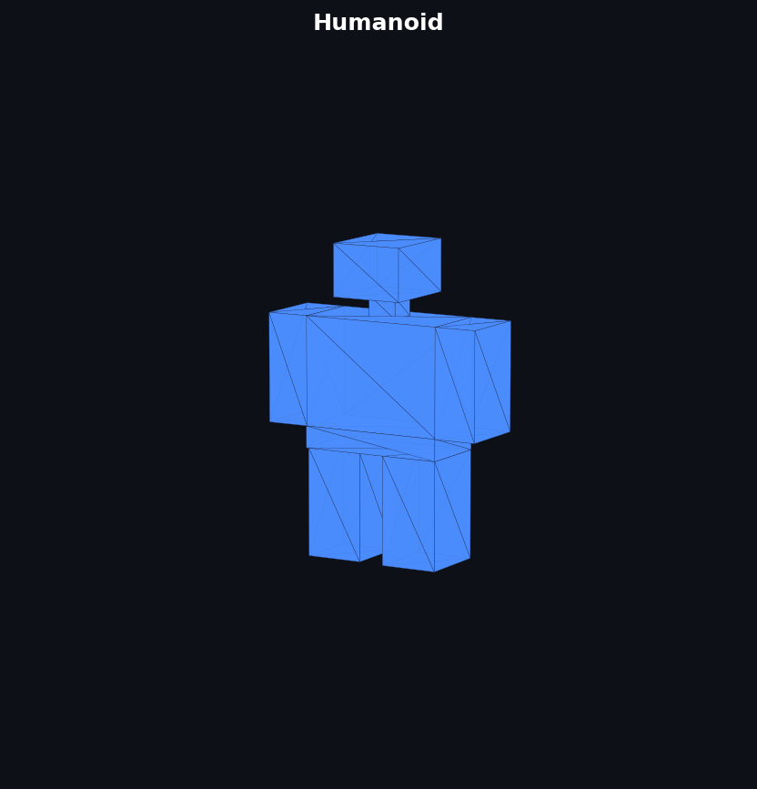
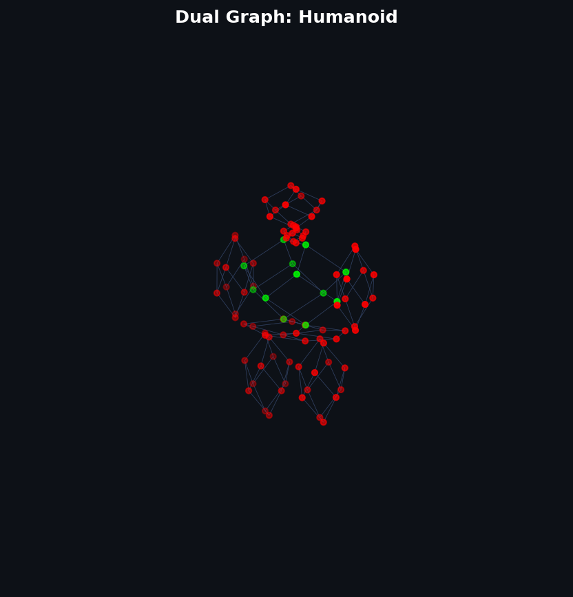
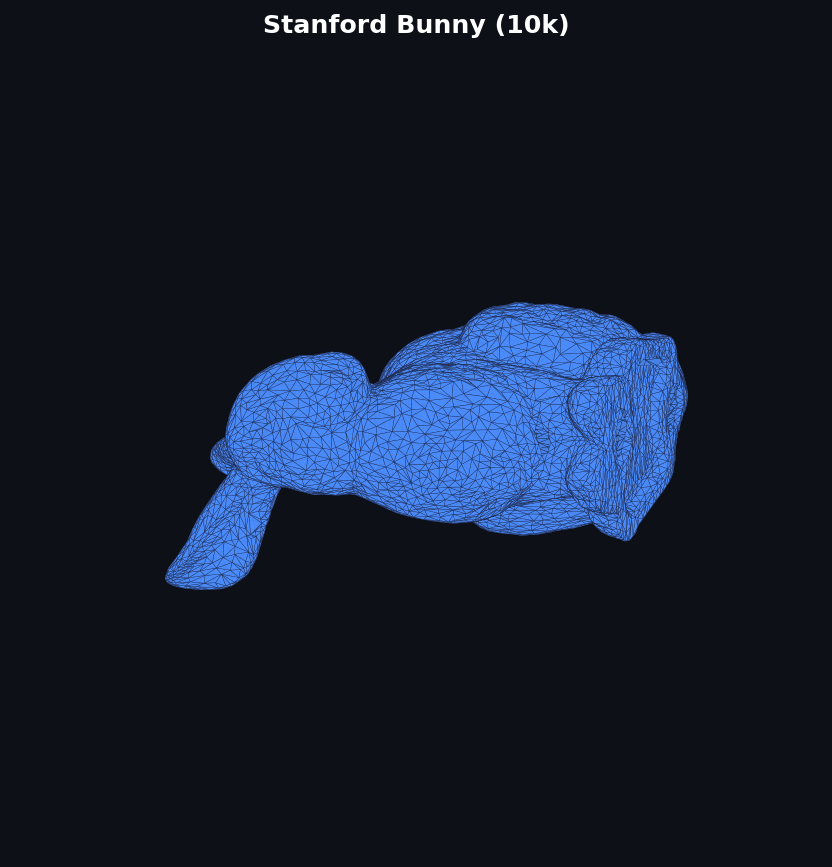
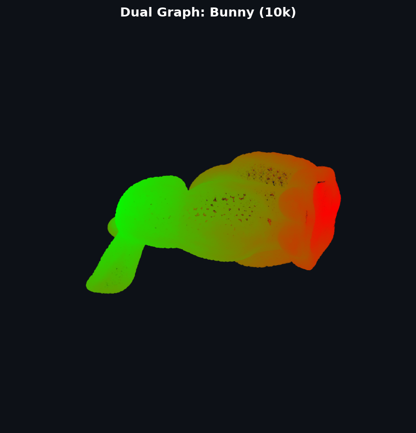

# Mesh → Dual Graph Transformation

A C implementation that converts a 3D triangular mesh into its **dual graph**, with a comparative study of four edge-sorting algorithms and Dijkstra-based graph coloring.

One key application is **medical imaging**: brain cortical surface meshes (from MRI segmentation pipelines like FreeSurfer) are triangular manifolds — exactly the kind of input this pipeline processes. The dual graph of a cortical surface captures face-level adjacency that can be used for region labeling, parcellation, and shortest-path analysis across the cortex.

📄 Full technical report: [`docs/report.pdf`](docs/report.pdf)

---

## What it does

Given a triangular mesh in `.obj` format, the program:

1. Parses vertices and faces from the input mesh
2. Extracts all mesh edges and sorts them using a chosen algorithm to find adjacent faces
3. Builds the dual graph — one node per face, positioned at the face centroid, connected to neighbors that share an edge
4. Runs Dijkstra's algorithm from a source node and colors each node by hop-distance, writing the result as a vertex-colored `.obj`

---

## Gallery

Each pair shows the original mesh (left) and its Dijkstra-colored dual graph (right). Node color encodes hop-distance from the source — green (close) → red (far).

**Brain cortical surface** (synthetic, 20 480 faces)

| Mesh | Dual Graph |
|:----:|:----------:|
|  |  |

**Other test meshes**

| Mesh | Dual Graph |
|:----:|:----------:|
|  |  |
|  |  |

---

## Algorithms

Four edge-sorting strategies are benchmarked for finding adjacent faces:

| Algorithm | Complexity | Notes |
|-----------|:----------:|-------|
| Selection Sort | O(n²) | Baseline — slow on large meshes |
| Heap Sort | O(n log n) | In-place, good for medium meshes |
| AVL Tree | O(n log n) | Self-balancing BST, in-order traversal gives sorted edges |
| Hash Table | O(n) avg | Fastest on large meshes |

Full benchmark results are in [`docs/report.pdf`](docs/report.pdf).

---

## Build & Usage

**Requirements:** GCC, GNU Make

```bash
git clone https://github.com/ashkan-motamedifar/dual-graph-coloring.git
cd dual-graph-coloring
make build
```

```
./exefile <input.obj> <output.obj> <algorithm> <color>
```

| Argument | Values |
|----------|--------|
| `algorithm` | `selectionsort` · `heapsort` · `avltree` · `hashtable` |
| `color` | `y` · `n` |

```bash
# Brain cortical surface — hash table, with Dijkstra coloring
./exefile assets/meshes/brain.obj out_brain.obj hashtable y

# Stanford Bunny (10k faces)
./exefile assets/meshes/bunny10k.obj out_bunny.obj hashtable y
```

---

## License

MIT — see [`LICENSE`](LICENSE).
